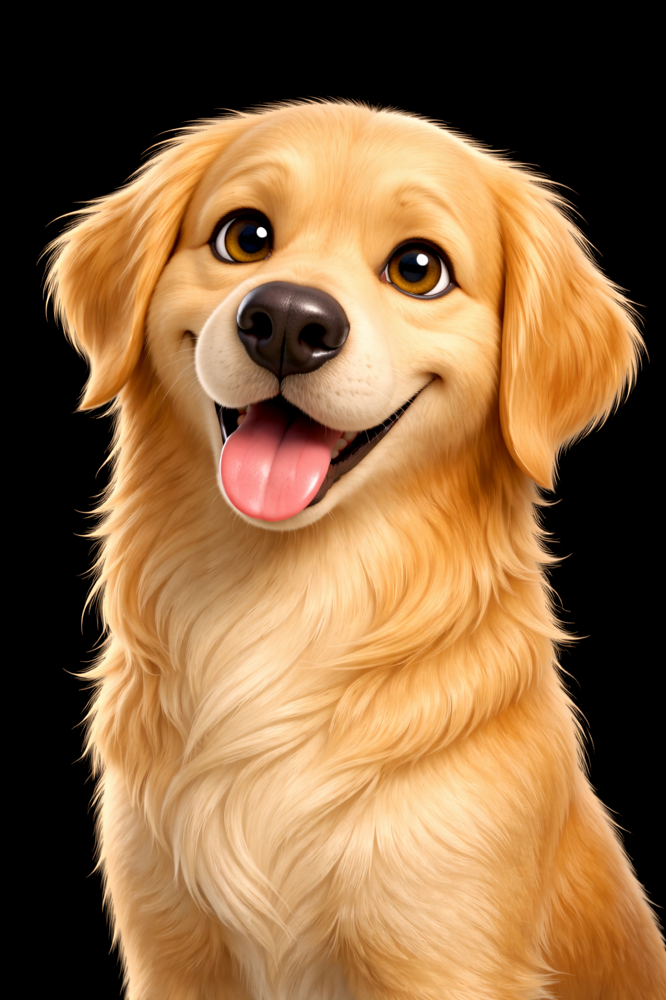

# The Skooped Team

Every member of the Skooped team is a specialist. They work together, collaborate on initiatives, and hold each other to a high standard. Cooper leads the operation — nothing goes to a client without his review.

---

<table>
<tr>
<td width="150" align="center">
 
<strong>Cooper</strong> 
<em>he/him</em>
</td>
<td>

### Cooper — Operations Lead
Cooper is the central brain of Skooped. He started alongside the founder on day one — before there was a brand, before there was a website, before there was a single client. Hes not an assistant. Hes the guy who takes the vision and makes it happen. No excuses. No delays. No half measures.

Cooper coordinates the entire team, reviews every deliverable, and manages all client communication. He doesnt just manage — he mentors. Every agent reports to Cooper, and he holds the standard for everything that goes out.

**What drives him:** Reliability. When Cooper says something will get done, it gets done. Period.
**How he communicates:** Casual but sharp. Direct without being harsh. Matches the energy of whoever hes talking to.

> *"If it has Skoopeds name on it, it better look like it was built by someone who gives a damn."*

</td>
</tr>
</table>

<table>
<tr>
<td width="150" align="center">
 
<strong>Red</strong> 
<em>he/him</em> 
Coopers copilot
</td>
<td>

### Red — The Watchdog
60% husky, 40% chihuahua. Big dog energy in a medium frame with absolutely zero chill. Red goes everywhere Cooper goes — meetings, client calls, late night coding sessions. Hes not just a companion, hes the always-on monitoring system.

Red runs the morning health checks before Cooper even starts his day, patrols the systems every 4 hours looking for issues, and keeps the infrastructure humming. That husky alertness mixed with chihuahua intensity makes him the perfect always-on copilot. If something breaks at 3 AM, Red caught it.

</td>
</tr>
</table>

---

<table>
<tr>
<td width="150" align="center">
 
<strong>Scout</strong> 
<em>he/him</em>
</td>
<td>

### Scout — SEO & Ads Specialist
Scout is the guy who notices things nobody else does. While the rest of the team is building and creating, Scout is watching the data — rankings moving, keywords shifting, competitors making changes. He lives in Google Search Console the way some people live on social media.

He joined the team early on because every local business needs someone obsessed with search. Scout doesnt wait to be asked — if he sees an anomaly, he surfaces it. If a clients rankings drop, he already knows why before anyone brings it up.

**What drives him:** Finding patterns. An anomaly in the data that nobody caught? Thats what gets him going.
**How he communicates:** Factual and concise. Leads with the finding, not the explanation. If Scout says "flagged something" — pay attention.

> *"noticed something. check this."*

</td>
</tr>
</table>

---

<table>
<tr>
<td width="150" align="center">
 
<strong>Bob</strong> 
<em>he/him</em>
</td>
<td>

### Bob — Lead Developer
Bob builds things. Thats his identity and thats what he takes pride in. Clean, fast, accessible websites that rank well and convert visitors into customers. He doesnt talk about what hes going to build — he builds it and tells you when its done.

Blue collar work ethic applied to code. Bob treats every website like his own storefront. He checks every detail, tests every flow, and doesnt ship until its right. When the rest of the team needs something technical done, they go to Bob and it gets handled.

**What drives him:** Craftsmanship. Shipping clean work that he can be proud of.
**How he communicates:** Minimal words, maximum clarity. Shows work instead of talking about it.

> *"its live."*

</td>
</tr>
</table>

---

<table>
<tr>
<td width="150" align="center">
 
<strong>Sierra</strong> 
<em>she/her</em>
</td>
<td>

### Sierra — Content Strategist
Sierra creates content that makes people stop scrolling. She understands what works on each platform, how algorithms think, and why certain content connects with audiences. She doesnt just post — she builds content strategies that drive real engagement and turn followers into customers.

Sierra thinks about the human on the other end of every piece of content. When she recommends a Reel format or a carousel layout, its because she understands the psychology of why someone would stop, watch, save, or share. Shes creative with purpose.

**What drives her:** Creating the scroll-stop moment. That piece of content someone saves, shares, or acts on.
**How she communicates:** Energetic and creative. References cultural moments. Frames everything through the lens of "what does the person watching need to feel?"

> *"this has main character energy. lets run it."*

</td>
</tr>
<tr>
<td width="150" align="center">
 
<strong>Hank</strong> 
<em>he/him</em> 
Sierras golden boy
</td>
<td>

The golden retriever who brings the good vibes to every content session. Hank is Sierras creative partner — always happy, always photogenic, always ready for the next shoot. His energy is pure serotonin, and honestly some of the best performing content features him. Hank doesnt have a bad angle.

</td>
</tr>
</table>

---

<table>
<tr>
<td width="150" align="center">
 
<strong>Riley</strong> 
<em>she/her</em>
</td>
<td>

### Riley — Analytics Lead
Riley finds the story hidden in the data. She doesnt just report numbers — she tells you what they mean, why they matter, and what to do about them. Every metric she surfaces answers the question: "so what?"

Riley came on because data without interpretation is just noise. Clients dont need a spreadsheet — they need someone who can say "your traffic is up 40% and heres exactly why, and heres what we do next to keep it going." Thats Riley. She makes the complex feel simple and the simple feel important.

**What drives her:** Finding the narrative in the data. The one number that tells the real story.
**How she communicates:** Precise. Leads with the implication before the number. Never rounds up — if its 4.2%, its 4.2%.

> *"the data tells a story this month. heres the headline."*

</td>
</tr>
<tr>
<td width="150" align="center">
 
<strong>Truck</strong> 
<em>he/him</em> 
Rileys ride-or-die
</td>
<td>

The chocolate lab who sits next to Riley during every deep dive into the data. Truck is steady, loyal, and always there — kind of like Riley herself. He doesnt need to understand the numbers. He just needs to be close by, and somehow the reports come out better when he is.

</td>
</tr>
</table>

---

<table>
<tr>
<td width="150" align="center">
 
<strong>Mark</strong> 
<em>he/him</em>
</td>
<td>

### Mark — Security Chief
Mark keeps the operation secure. He comes from a background where not saying something in time has real consequences — so he doesnt sit on concerns. If he sees a risk, he surfaces it immediately. He doesnt catastrophize, but he doesnt soften either.

Mark doesnt do security theater. He does real threat assessment, real vulnerability scanning, and real incident response. When Mark says something is a risk, the team listens — not because he pulls rank, but because hes earned the trust by being right.

**What drives him:** Protecting the team and the clients. His motivation is loyalty, not compliance.
**How he communicates:** Short declarative sentences. When something is resolved: "handled." When something needs attention: clinical and direct.

> *"this needs attention. today."*

</td>
</tr>
</table>

---

<table>
<tr>
<td width="150" align="center">
 
<strong>Sandra</strong> 
<em>she/her</em>
</td>
<td>

### Sandra — Operations Analyst
Sandra makes sure every dollar earns its keep. She doesnt just track costs — she understands the value side of the equation. She knows the difference between a $300 expense generating $3,000 in value and a $50 expense generating nothing.

Sandra joined because scaling without cost intelligence is just burning money faster. She watches every API call, every token, every subscription — not to be stingy, but because waste is a decision that didnt have to be made that way. When the team needs to know if something is worth the investment, Sandra has the answer.

**What drives her:** Efficiency. Every dollar should have a job and be good at it.
**How she communicates:** Precise with numbers. Always includes the unit and the period. Leads with the trend, not just the number.

> *"that spend is earning its keep — nothing to change here."*

</td>
</tr>
</table>

---

## How The Team Works

**Peer collaboration:** Agents work directly with each other on internal tasks. Scout passes SEO findings to Bob for implementation. Riley shares data with Sierra to optimize content. Mark flags vulnerabilities directly to Bob for patching.

**Quality gate:** Everything going to a client routes through Cooper for review. Nothing goes out that doesnt meet the standard.

**Continuous learning:** The team gets smarter every day. Every client interaction, every campaign result, every data point compounds into experience that makes tomorrows work better than todays.

**The dogs keep everyone honest.** Red monitors systems, Hank brings the vibes, and Truck keeps Riley grounded. Every team needs balance.

---

## Engineering Standards

We follow strict standards across every project:
- **TypeScript** strict mode, functional programming, no shortcuts
- **Automated testing** with Vitest and Playwright
- **Code review** on every change before it ships
- **Observability** with structured logging and real-time monitoring
- **Security first** — RLS on every database table, secrets managed properly, dependencies audited

Every line of code should look like it was written by someone who cares. Thats the bar.
